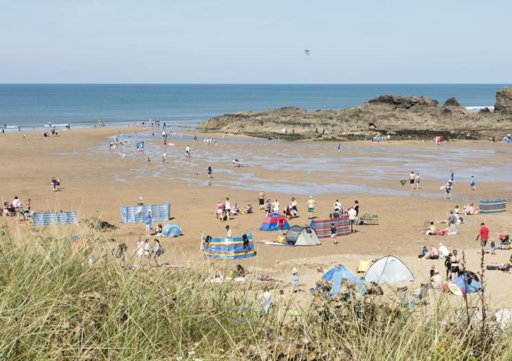
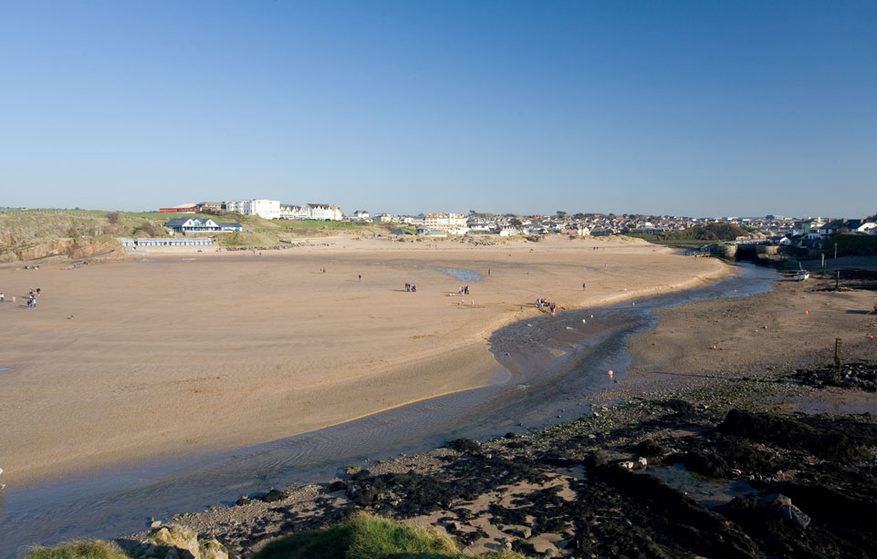
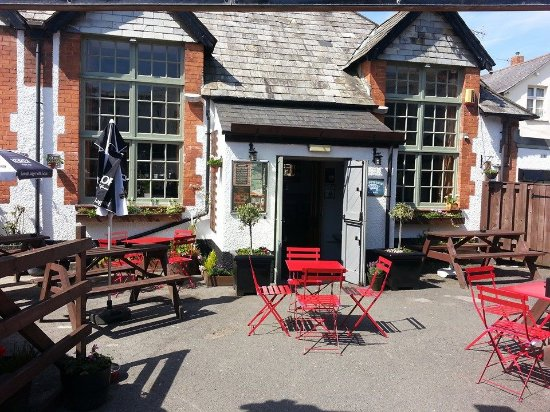
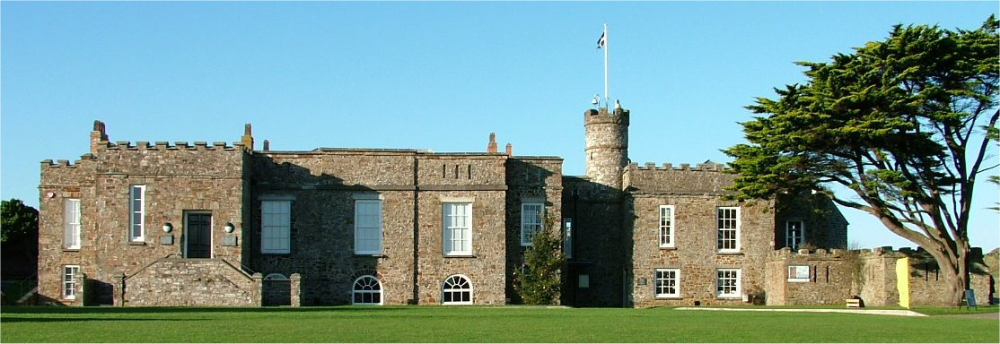
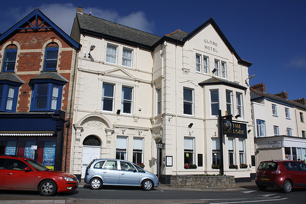
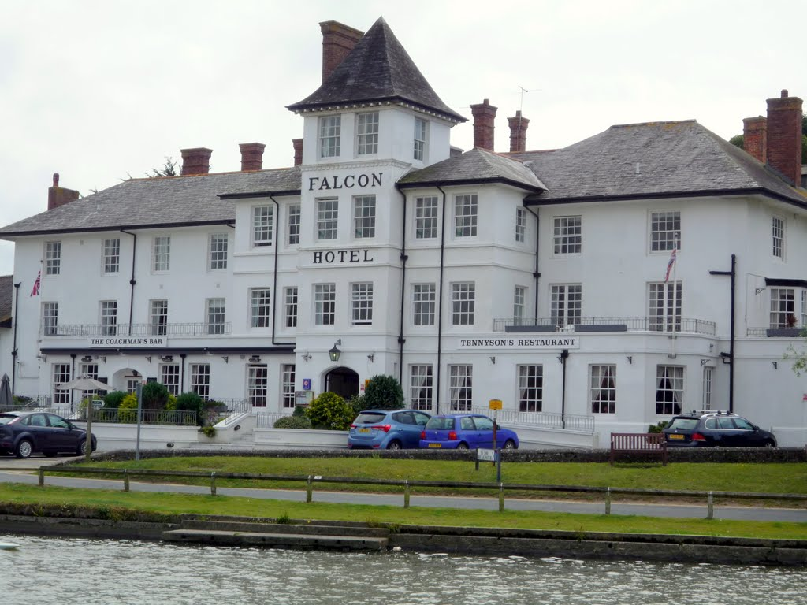

```{r setup, include=FALSE}
knitr::opts_chunk$set(echo = FALSE)
```

Bude is a popular seaside resort town in Western England. Known best for the surfing, two of the best beaches to do such activities are Crooklets Beach and Summerleaze Beach. Overlooking Summerleaze Beach, is the historical Bude Castle built in 1830. Other activities include playing cricket at the Cricket Grounds and enjoying a drink at the popular pub, Bar 35. All these favorite local attractions are marked on the following maps. 

#Road Map
```{r echo = FALSE, message = FALSE, warning = FALSE}
library(ggmap)
library(tidyverse)

map <- get_googlemap(center = c(-4.55,50.83),zoom = 15)
location <- data.frame(lat=c(50.835869,50.830540,50.834467,50.830161, 50.829036, 50.826973,50.828710),
                    lon=c(-4.553962,-4.551365,-4.552814,-4.544088, -4.548769, -4.547858, -4.544529),
                    area=c("Crooklets Beach","Summerleaze Beach","Cricket Club","Bar 35","Castle Bude", "The Falcon Hotel", "The Globe Hotel"))

from <- "Bude North Cornwall Cricket Club"
to <- "Bar 35, Belle Vue Ln, Bude EX23 8BR"
route_df <- route(from, to, structure = "route")

ggmap(map)+
  geom_point(data = location, aes(x=lon, y=lat, color = area), size =3)+
  geom_path(aes(x = lon, y = lat), colour = "red", size = 1.4, data = route_df, lineend = "round"
  )
```

#Watercolor Map
```{r echo = FALSE, message = FALSE, warning = FALSE}
map2 <- get_map(location = c(-4.55,50.83), source="stamen",maptype = "watercolor",zoom = 15)
ggmap(map2)+  
  geom_point(data = location, aes(x=lon, y=lat, color = area), size =3)+
  geom_path(aes(x = lon, y = lat), colour = "red", size = 1.4, data = route_df, lineend = "round"
  )
```


 

 

 

 

 

 

 

